# Biometric Access Control & Security Terminal v3.4.0

[](https://github.com/ans036/Face_auth_system/actions/workflows/ci.yml)
[](https://python.org)
[](https://fastapi.tiangolo.com)
[](https://docker.com)
[](LICENSE)

A professional-grade **Multi-Modal Biometric System** fusing **Face Recognition (InsightFace)**, **Voice Authentication (SpeechBrain)**, and **Liveness Detection** for high-security enterprise access control. Now powered by **PostgreSQL + pgvector** for enterprise-scale performance.

> **Status**: ✅ Production Ready | v3.4.0  
> **Latest**: FAR/FRR Metrics, Performance Benchmarks, Security Hardening

---

## 📐 System Architecture

```mermaid
graph TB
    subgraph Frontend["🖥️ Frontend (Node.js)"]
        UI[Web Interface]
        WC[WebRTC Camera]
        MIC[Audio Capture]
    end
    
    subgraph Backend["⚙️ Backend (FastAPI)"]
        API[API Layer]
        RL[Rate Limiter]
        
        subgraph Core["Core Processing"]
            FD[Face Detector<br/>MediaPipe]
            FE[Face Embedder<br/>InsightFace]
            VE[Voice Embedder<br/>SpeechBrain]
            VP[Voice Preprocessor<br/>VAD + Denoise]
            LD[Liveness Detector<br/>Blink EAR]
        end
        
        subgraph Recognition["Recognition Engine"]
            SM[Softmax Classifier]
            AT[Adaptive Threshold]
            MF[Multimodal Fusion]
        end
    end
    
    subgraph Database["🗄️ Database"]
        PG[(PostgreSQL<br/>+ pgvector)]
        HNSW[HNSW Index]
    end
    
    UI --> API
    WC --> API
    MIC --> API
    API --> RL
    RL --> FD
    FD --> FE
    FE --> SM
    MIC --> VP
    VP --> VE
    VE --> MF
    SM --> MF
    MF --> AT
    FE --> PG
    VE --> PG
    PG --> HNSW
```



---

## 🎥 System Demo

### Live Scanner Action


### Face-Gated Secure Messages


---

## 🚀 Key Features

### 🛡️ Multi-Modal Security
*   **Face Recognition**: InsightFace Buffalo-L model (600K identity training)
*   **Voice Authentication**: SpeechBrain ECAPA-TDNN speaker verification
*   **Liveness Detection**: Real-time blink eye tracking to prevent photo spoofing
*   **Fusion Logic**: Adaptive scoring combines face + voice probabilities

### ⚡ Enterprise Performance
*   **PostgreSQL + pgvector**: Native vector similarity search using HNSW indexing
*   **100x Faster**: Sub-10ms queries for large galleries (vs 500ms+ with SQLite)
*   **Rate Limiting**: IP-based throttling with exponential backoff
*   **Secure Auth**: Bcrypt password hashing with timing-attack resistance

### 📊 Performance Benchmarks

| Component | Mean Latency | P95 | P99 |
|-----------|-------------|-----|-----|
| Face Embedding | 24.23 ms | 30.34 ms | 48.36 ms |
| Voice Embedding | 2.47 ms | 2.56 ms | 2.62 ms |
| Database Query (1K) | 1.71 ms | - | - |

#### Scalability & Latency

*Figure 1: Query latency scaling (Log-Log plot). Postgres (Green) maintains constant time vs SQLite (Blue).*


*Figure 2: Database query latency comparison.*

### 📈 Biometric Accuracy (FAR/FRR)

| Metric | Face | Voice |
|--------|------|-------|
| **EER** | ~18% | ~21% |
| AUC | 0.89 | 0.86 |

#### ROC Curves
<p float="left">
  
   
</p>
*Figure 3: ROC Curves for Face Recognition (Left) and Voice Verification (Right).*

#### Score Distributions

*Figure 4: Genuine (Green) vs Impostor (Red) score distributions showing clear separation.*

Generate evaluation report:
```bash
docker compose run --rm backend python scripts/biometric_evaluation.py
# Output: ROC curves, DET curves, score distributions
```

---

## 🔧 Challenges & Solutions: Edge Cases & Technical Deep Dives

### 1. High-Dimensional Tensor Mismatches in Fusion Logic
**Challenge**: The fusion layer requires concatenating face embeddings (512-dim) with voice embeddings (192-dim). However, the SpeechBrain model occasionally returned `[1, 1, 192]` tensors while InsightFace returned `(512,)` arrays, causing subtle broadcasting errors during matrix multiplication that silently degraded accuracy.

**Solution**: implemented a strict **Tensor Normalization Decorator** that enforces shape consistency before fusion.
```python
def normalize_tensor_shape(func):
    def wrapper(*args):
        emb = func(*args)
        # Squeeze dimensions: [1, 1, 192] -> [192]
        return np.squeeze(emb) if emb.ndim > 1 else emb
    return wrapper
```

### 2. Blocking I/O in Asyncio Event Loop
**Challenge**: The `scipy.io.wavfile.read` function is blocking. When processing multiple concurrent voice authentication requests, the main FastAPI event loop would freeze during file I/O, causing a latency spike from 50ms to 400ms for other users.

**Solution**: Offloaded file operations to a thread pool using `run_in_executor`.
```python
# Before: blocking call
rate, data = wavfile.read(path)

# After: non-blocking execution
loop = asyncio.get_event_loop()
rate, data = await loop.run_in_executor(None, wavfile.read, path)
```

### 3. Floating Point Precision in Vector Search
**Challenge**: When migrating from SQLite (exact match) to pgvector (HNSW index), we initially used the default `L2` distance. However, at large scale (>1M vectors), floating point errors in normalized vectors caused identical identities to return a distance of `0.0000004` instead of `0.0`, failing the strict `dist == 0` cache hit check.

**Solution**: Switched to **Cosine Distance** logic for HNSW and implemented an epsilon-based comparison.
```sql
-- pgvector index creation
CREATE INDEX ON embeddings USING hnsw (embedding vector_cosine_ops);
```

### 4. Cold Start Latency in Docker Containers
**Challenge**: The first request to the inference engine took ~4 seconds (vs 20ms average) because PyTorch/ONNX models were lazy-loaded. This caused health checks to timeout during deployment.

**Solution**: Implemented a **Model Warmup Routine** during the container startup lifecycle event.
```python
@app.on_event("startup")
async def warmup_models():
    # Pass dummy tensors to force CUDA context initialization and graph compilation
    dummy_face = np.zeros((1, 3, 640, 640))
    face_model.inference(dummy_face)
```

### 5. Audio Clipping & Dynamic Range
**Challenge**: Users with loud microphones caused waveform clipping, resulting in distorted spectral features that the authentication model confidently misclassified (high False Accept Rate).

**Solution**: Added an **Adaptive RMS Normalizer** in the preprocessing pipeline.
- Detects peak amplitude.
- If clipping (>0.95), applies dynamic range compression.
- If too quiet (<0.01), amplifies signal before embedding generation.

### 6. Dependency Hell: PyTorch vs. OnnxRuntime
**Challenge**: The official `speechbrain` library requires specific PyTorch versions, while `insightface` depends on `onnxruntime` which has conflicts with certain CUDA libraries in the base `python:3.10-slim` image.

**Solution**: Crafted a specific probabilistic installation order in `Dockerfile` and used a multi-stage build to isolate build dependencies (gcc, g++) from the runtime environment, reducing image size by 40% and resolving shared library conflicts.

---

## 🛠️ Tech Stack

| Component | Technology |
|-----------|------------|
| **AI Models** | InsightFace (Face) + SpeechBrain (Voice) |
| **Backend** | FastAPI + SQLAlchemy (Async) |
| **Database** | **PostgreSQL + pgvector** (Production) / SQLite (Dev Fallback) |
| **Vector Search** | Hierarchical Navigable Small World (HNSW) Index |
| **Frontend** | Vanilla JS + WebRTC + Chart.js |
| **Container** | Docker Compose (Full Stack) |
| **Security** | Bcrypt, Rate Limiting, Session Tokens |

---

## 📂 API Endpoints

| Endpoint | Method | Description |
|----------|--------|-------------|
| `/identify/` | POST | Multi-modal identification (Rate Limited) |
| `/admin/login` | POST | Secure admin login (Bcrypt) |
| `/admin/logs` | GET | Retrieve security logs |
| `/admin/stats` | GET | System statistics |
| `/enroll/` | POST | Enroll new users/voices |
| `/gallery/rebuild` | POST | Rebuild embeddings gallery |

---

## 🚦 Getting Started

### 1. Prerequisites
*   **Docker Desktop** (WSL2 backend recommended)
*   **Git LFS** (for large model files)

### 2. Setup Database
Place user images in `database/<username>/` and voice samples (optional) in `database/<username>/voice/`.

### 3. Deploy
```bash
docker compose up --build
```
*Auto-migration scripts will handle the database creation.*

### 4. Access
*   **Live Scanner**: http://localhost:3000
*   **Admin Panel**: http://localhost:3000/admin.html
*   **API Docs**: http://localhost:8001/docs

---

## 🔧 Configuration

| Setting | Value | Description |
|---------|-------|-------------|
| **DB Backend** | Postgres | Automatic fallback to SQLite if unavailable |
| **Face Weight** | 0.85 | Primary biometric factor |
| **Voice Weight** | 0.15 | Secondary booster factor |
| **Rate Limit** | 120/min | Per-IP request limit |
| **Liveness** | Blink | Required for "Live" status |

---

## 🛡️ Security Features
*   **Rate Limiting**: 120 requests/minute per IP with exponential backoff
*   **Bcrypt Auth**: Secure password hashing for admin panel
*   **Green Box**: Authenticated (Face + Voice + Life)
*   **Red Box**: Unknown subject
*   **📸 Evidence**: Unauthorized images saved to `unauthorized_attempts/`
*   **Security Log**: Automatically generated in `security.log`

---

## 🧪 Testing

Run the full test suite (49 tests):

```bash
docker compose run --rm backend pytest tests/ -v

# Output:
# 49 passed in 4.73s
# ├── test_admin.py        - 13 tests
# ├── test_biometrics.py   - 10 tests
# ├── test_enroll.py       -  6 tests
# ├── test_gallery.py      -  8 tests
# ├── test_health.py       -  4 tests
# └── test_rate_limiter.py -  8 tests
```

---

## 📊 Generated Reports & Graphs

The `scripts/` directory contains tools for generating publication-ready visualizations:

```bash
# Performance benchmarks
python scripts/benchmark.py
# → db_comparison.png, scalability_curve.png, benchmark_report.md

# Biometric evaluation (FAR/FRR/EER)
python scripts/biometric_evaluation.py  
# → face_roc_curve.png, voice_roc_curve.png, biometric_evaluation_report.md
```

---

## 🔧 Quick Troubleshooting

**Docker fails to start**
- Ensure Docker Desktop is running with WSL2 backend based.
- Run `docker compose down -v` to reset volumes (WARNING: clears database).

**Models not loading**
- Run `git lfs pull` to fetch large model files.
- Check `backend/models/` directory has `.onnx` files.

---

## 🚀 Future Enhancements

- [ ] Integration with LDAP/Active Directory
- [ ] Mobile SDK for Android/iOS
- [ ] Real-time analytics dashboard
- [ ] Multi-language support for admin panel
- [ ] REST API authentication with JWT

---

## ⚖️ License
MIT License
