# Biometric Access Control & Security Terminal v3.4.0

[](https://github.com/ans036/Face_auth_system/actions/workflows/ci.yml)

A professional-grade **Multi-Modal Biometric System** fusing **Face Recognition (InsightFace)**, **Voice Authentication (SpeechBrain)**, and **Liveness Detection** for high-security enterprise access control. Now powered by **PostgreSQL + pgvector** for enterprise-scale performance.

> **Status**: ✅ Production Ready | v3.4.0  
> **Latest**: FAR/FRR Metrics, Performance Benchmarks, Security Hardening

---

## 📐 System Architecture

```mermaid
graph TB
    subgraph Frontend["🖥️ Frontend (Node.js)"]
        UI[Web Interface]
        WC[WebRTC Camera]
        MIC[Audio Capture]
    end
    
    subgraph Backend["⚙️ Backend (FastAPI)"]
        API[API Layer]
        RL[Rate Limiter]
        
        subgraph Core["Core Processing"]
            FD[Face Detector<br/>MediaPipe]
            FE[Face Embedder<br/>InsightFace]
            VE[Voice Embedder<br/>SpeechBrain]
            VP[Voice Preprocessor<br/>VAD + Denoise]
            LD[Liveness Detector<br/>Blink EAR]
        end
        
        subgraph Recognition["Recognition Engine"]
            SM[Softmax Classifier]
            AT[Adaptive Threshold]
            MF[Multimodal Fusion]
        end
    end
    
    subgraph Database["🗄️ Database"]
        PG[(PostgreSQL<br/>+ pgvector)]
        HNSW[HNSW Index]
    end
    
    UI --> API
    WC --> API
    MIC --> API
    API --> RL
    RL --> FD
    FD --> FE
    FE --> SM
    MIC --> VP
    VP --> VE
    VE --> MF
    SM --> MF
    MF --> AT
    FE --> PG
    VE --> PG
    PG --> HNSW
```



---

## 🚀 Key Features

### 🛡️ Multi-Modal Security
*   **Face Recognition**: InsightFace Buffalo-L model (600K identity training)
*   **Voice Authentication**: SpeechBrain ECAPA-TDNN speaker verification
*   **Liveness Detection**: Real-time blink eye tracking to prevent photo spoofing
*   **Fusion Logic**: Adaptive scoring combines face + voice probabilities

### ⚡ Enterprise Performance
*   **PostgreSQL + pgvector**: Native vector similarity search using HNSW indexing
*   **100x Faster**: Sub-10ms queries for large galleries (vs 500ms+ with SQLite)
*   **Rate Limiting**: IP-based throttling with exponential backoff
*   **Secure Auth**: Bcrypt password hashing with timing-attack resistance

### 📊 Performance Benchmarks

| Component | Mean Latency | P95 | P99 |
|-----------|-------------|-----|-----|
| Face Embedding | 24.23 ms | 30.34 ms | 48.36 ms |
| Voice Embedding | 2.47 ms | 2.56 ms | 2.62 ms |
| Database Query (1K) | 1.71 ms | - | - |

#### Scalability & Latency

*Figure 1: Query latency scaling (Log-Log plot). Postgres (Green) maintains constant time vs SQLite (Blue).*


*Figure 2: Database query latency comparison.*

### 📈 Biometric Accuracy (FAR/FRR)

| Metric | Face | Voice |
|--------|------|-------|
| **EER** | ~18% | ~21% |
| AUC | 0.89 | 0.86 |

#### ROC Curves
<p float="left">
  
   
</p>
*Figure 3: ROC Curves for Face Recognition (Left) and Voice Verification (Right).*

Generate evaluation report:
```bash
docker compose run --rm backend python scripts/biometric_evaluation.py
# Output: ROC curves, DET curves, score distributions
```

---

## 🔧 Challenges & Solutions

This section documents real debugging challenges encountered during development—demonstrating problem-solving skills and deep understanding of the system.

### 1. Color Space Mismatch (BGR vs RGB)

**Problem**: InsightFace expects BGR images, but MediaPipe returns RGB. This caused face detection to fail intermittently.

**Debugging**: Added logging to capture color channel values. Noticed blue/red channel swap pattern.

**Solution**:
```python
# Fixed in core/embedder.py
image_bgr = cv2.cvtColor(image_rgb, cv2.COLOR_RGB2BGR)
faces = self.app.get(image_bgr)
```

---

### 2. PostgreSQL Connection Race Condition

**Problem**: Backend container started before PostgreSQL was ready, causing `psycopg2.OperationalError`.

**Debugging**: Docker logs showed connection attempts before `postgres:ready`. Health checks passed but app started too early.

**Solution**: Added explicit health check dependency in `docker-compose.yml`:
```yaml
backend:
  depends_on:
    postgres:
      condition: service_healthy
```

---

### 3. Voice Model Permission Denied in Docker

**Problem**: SpeechBrain model download failed with `Permission denied` when running as non-root user.

**Debugging**: Traced to HuggingFace cache directory ownership. Container user (appuser:1000) couldn't write to `/app/models`.

**Solution**: 
```dockerfile
# Dockerfile
RUN mkdir -p /home/appuser/.cache/huggingface && \
    chown -R appuser:appuser /home/appuser/.cache
```

---

### 4. Embedding Format for pgvector

**Problem**: Tests failed with `ValueError: could not convert string to float` when using pgvector.

**Debugging**: pgvector expects `list` or `ndarray`, but code was passing `bytes` from `.tobytes()`.

**Solution**:
```python
# Fixed: use .tolist() instead of .tobytes()
entry = Gallery(username=username, embedding=embedding.tolist())
```

---

### 5. Unicode Emoji Encoding on Windows

**Problem**: Print statements with emojis (⚠️) crashed on Windows with `UnicodeEncodeError`.

**Debugging**: Windows console uses cp1252 encoding which doesn't support emojis.

**Solution**: Replaced emojis with ASCII alternatives in console output:
```python
# Before: print("⚠️ bcrypt not available")
# After:  print("[WARNING] bcrypt not available")
```

---

### 6. Voice Preprocessing Rejecting Valid Audio

**Problem**: Benchmark script showed all voice samples failing quality checks.

**Debugging**: Quality assessor was correctly rejecting random noise (SNR < 10dB). This was actually **correct behavior**—the test was using synthetic noise, not real speech.

**Lesson**: The preprocessor works as designed. Real speech passes; synthetic noise fails.

---

## 🛠️ Tech Stack

| Component | Technology |
|-----------|------------|
| **AI Models** | InsightFace (Face) + SpeechBrain (Voice) |
| **Backend** | FastAPI + SQLAlchemy (Async) |
| **Database** | **PostgreSQL + pgvector** (Production) / SQLite (Dev Fallback) |
| **Vector Search** | Hierarchical Navigable Small World (HNSW) Index |
| **Frontend** | Vanilla JS + WebRTC + Chart.js |
| **Container** | Docker Compose (Full Stack) |
| **Security** | Bcrypt, Rate Limiting, Session Tokens |

---

## 📂 API Endpoints

| Endpoint | Method | Description |
|----------|--------|-------------|
| `/identify/` | POST | Multi-modal identification (Rate Limited) |
| `/admin/login` | POST | Secure admin login (Bcrypt) |
| `/admin/logs` | GET | Retrieve security logs |
| `/admin/stats` | GET | System statistics |
| `/enroll/` | POST | Enroll new users/voices |
| `/gallery/rebuild` | POST | Rebuild embeddings gallery |

---

## 🚦 Getting Started

### 1. Prerequisites
*   **Docker Desktop** (WSL2 backend recommended)
*   **Git LFS** (for large model files)

### 2. Setup Database
Place user images in `database/<username>/` and voice samples (optional) in `database/<username>/voice/`.

### 3. Deploy
```bash
docker compose up --build
```
*Auto-migration scripts will handle the database creation.*

### 4. Access
*   **Live Scanner**: http://localhost:3000
*   **Admin Panel**: http://localhost:3000/admin.html
*   **API Docs**: http://localhost:8001/docs

---

## 🔧 Configuration

| Setting | Value | Description |
|---------|-------|-------------|
| **DB Backend** | Postgres | Automatic fallback to SQLite if unavailable |
| **Face Weight** | 0.85 | Primary biometric factor |
| **Voice Weight** | 0.15 | Secondary booster factor |
| **Rate Limit** | 30/min | Per-IP request limit |
| **Liveness** | Blink | Required for "Live" status |

---

## 🛡️ Security Features
*   **Rate Limiting**: 30 requests/minute per IP with exponential backoff
*   **Bcrypt Auth**: Secure password hashing for admin panel
*   **Green Box**: Authenticated (Face + Voice + Life)
*   **Red Box**: Unknown subject
*   **📸 Evidence**: Unauthorized images saved to `unauthorized_attempts/`

---

## 🧪 Testing

Run the full test suite (49 tests):

```bash
docker compose run --rm backend pytest tests/ -v

# Output:
# 49 passed in 4.73s
# ├── test_admin.py        - 13 tests
# ├── test_biometrics.py   - 10 tests
# ├── test_enroll.py       -  6 tests
# ├── test_gallery.py      -  8 tests
# ├── test_health.py       -  4 tests
# └── test_rate_limiter.py -  8 tests
```

---

## 📊 Generated Reports & Graphs

The `scripts/` directory contains tools for generating publication-ready visualizations:

```bash
# Performance benchmarks
python scripts/benchmark.py
# → db_comparison.png, scalability_curve.png, benchmark_report.md

# Biometric evaluation (FAR/FRR/EER)
python scripts/biometric_evaluation.py  
# → face_roc_curve.png, voice_roc_curve.png, biometric_evaluation_report.md
```

---

## ⚖️ License
MIT License
